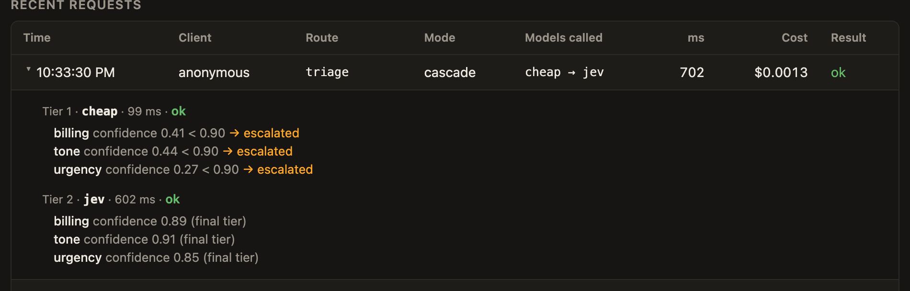
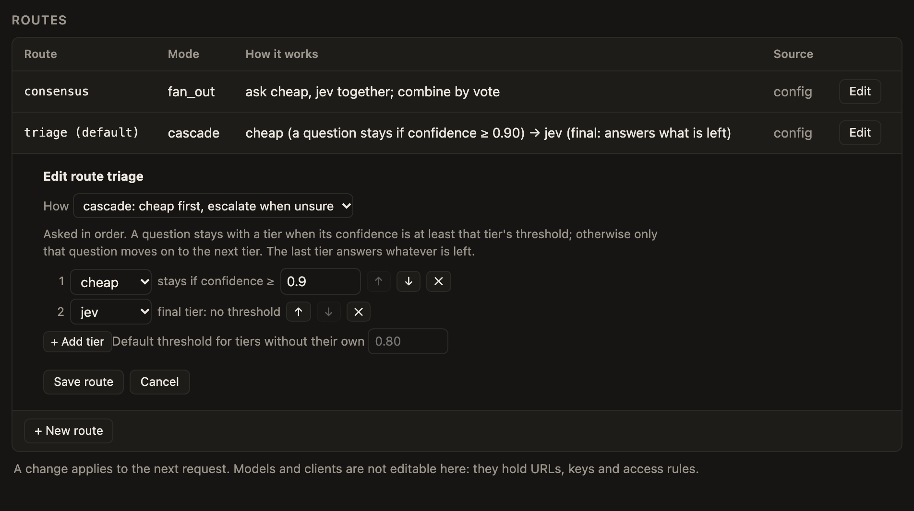
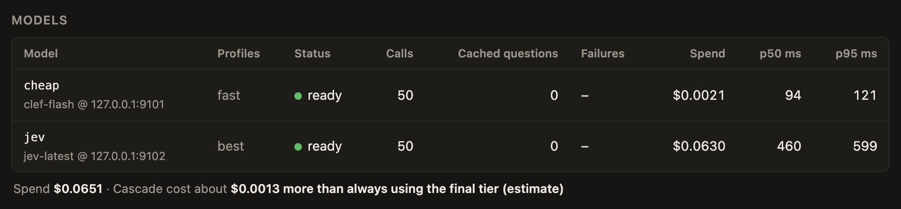
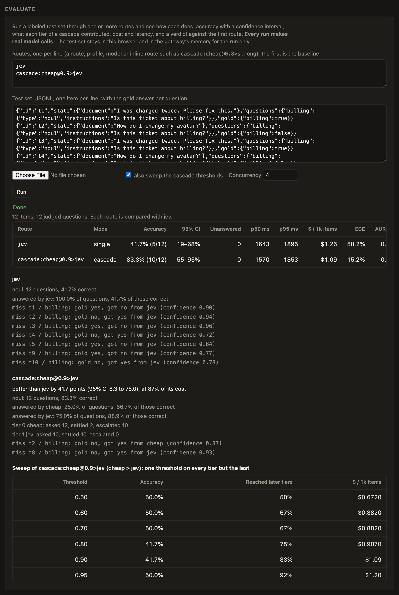
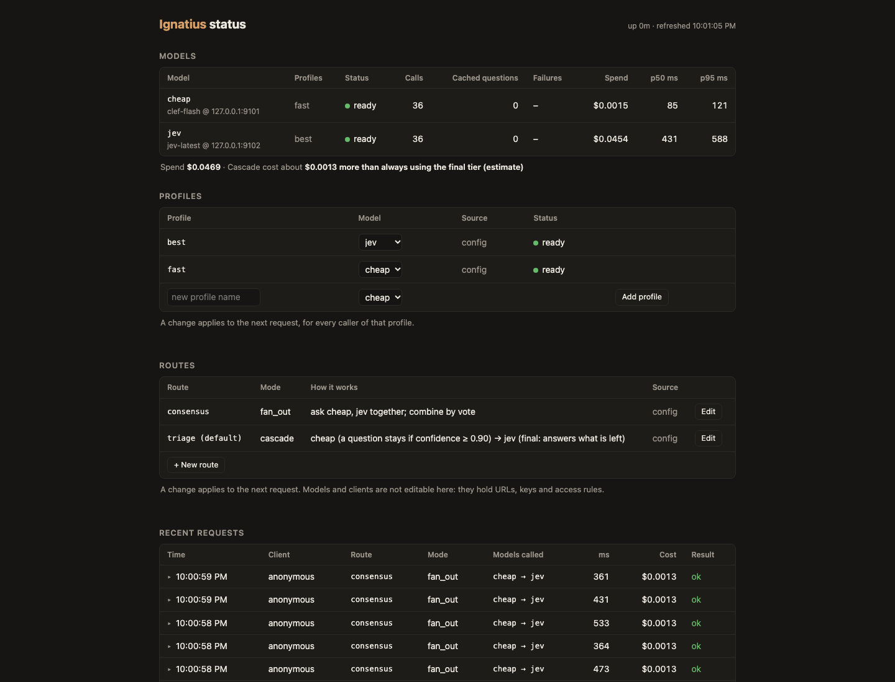
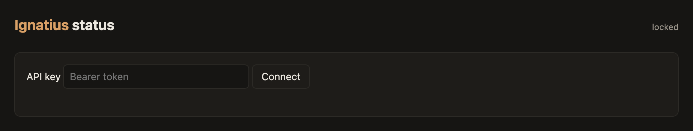
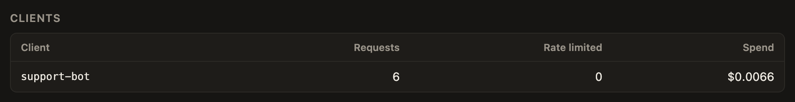
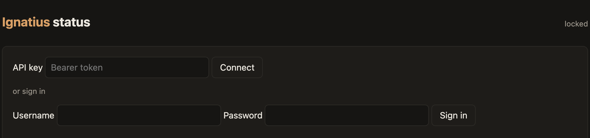
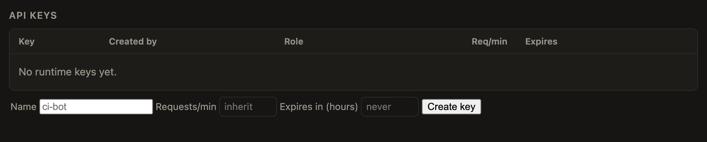

# Ignatius

Ignatius is a self-hosted gateway that sits in front of decision models like Jev, Clef and Decis. You ask one set of questions and get back normalized answers from whichever model (or models) you pick.

## Why

Decision models come in two flavors: fast and cheap, or slow and smart. You usually want both. Cheap for the easy stuff, smart for the hard stuff.

Every provider also answers a little differently. So you end up writing glue to normalize it all.

You could do that in a script. I did, kind of. But then you're also writing the retries, the thresholds, the logging, and the "why did it pick that one" part. That's the part that actually matters. Ignatius does the orchestration and hands you a trace of every decision it made.

## What it does

Three modes:

- **Single**: send the questions to one model. It's just a pass through that normalizes the answer.
- **Fan-out**: send the same questions to n models at once. You get all the answers back, or you combine them (vote, mean, most confident).
- **Cascade**: ask the cheap model first. Check how sure it is. Only send the questions it wasn't sure about to the next tier up.

```
questions ──> cheap model ──> confident? ──yes──> answer
                                  │
                                  no
                                  v
                             strong model ──> answer
```

The saving comes from the cascade. The cheap tier is confident on most questions, so the expensive model only ever sees the hard ones.

## Quickstart

### Run the gateway

You need Go 1.26 and a Jev key, or any server that speaks `/v1/systemone`.

**1. Build the binary** (or the distroless image) from the `go/` directory:

```sh
git clone https://github.com/phin-tech/ignatius && cd ignatius/go
go build -o ignatius ./cmd/ignatius      # or: docker build -t ignatius .
```

**2. Write an `ignatius.toml` with one model.** Secrets are environment variables the file names, never values in it:

```toml
listen = "127.0.0.1:8081"
default_route = "jev"

[models.jev]
provider = "systemone"                 # anything that speaks /v1/systemone
base_url = "https://api.typesafe.ai"
model = "jev-latest"
api_key_env = "TYPESAFE_API_KEY"
```

**3. Export the key and start the gateway:**

```sh
export TYPESAFE_API_KEY=...
./ignatius serve --config ignatius.toml
# {"msg":"ignatius listening on 127.0.0.1:8081; models [jev]; routes []"}
```

**4. Check that it's up.** `GET /healthz` and `GET /readyz` answer without a key, and `/` is the status page. On a loopback address no client key is needed. To listen anywhere else, turn on auth (see [Auth](#auth)).

### Make a call

The gateway speaks Jev's `/v1/systemone`, so anything that talks to Jev can talk to it.

**1. Send two questions**, a yes/no and a choice:

```sh
curl -s localhost:8081/v1/systemone -d '{
  "state": {"document": "I was charged twice. Please fix this ASAP."},
  "model": "jev",
  "questions": {
    "billing": {"type": "noul",   "instructions": "Is this ticket about billing?"},
    "tone":    {"type": "choice", "instructions": "What is the customer'"'"'s tone?",
                "criteria": {"calm": null, "frustrated": null}}
  }
}'
```

**2. Read the answer:**

```json
{
  "model": "jev",
  "answers": {
    "billing": {"type": "noul", "noul": 0.98},
    "tone": {"type": "choice", "choice": "frustrated", "probabilities": {"calm": 0, "frustrated": 1}, "confidence": 1}
  },
  "usage": {"input_tokens": 321, "output_tokens": 52},
  "ignatius": {"mode": "single", "request_id": "7aec6282a1af5595", "sources": {"billing": {"model": "jev"}, "tone": {"model": "jev"}}, "trace": null, "failures": []}
}
```

`ignatius` is the extra object only Ignatius adds. Every other field is what Jev returns, and clients that
do not know it ignore it.

**3. Or use the official SDK, unchanged.** Point `base_url` at the gateway. The SDK has no knob for routing, so the `model` name
selects a route, alias or inline route (below), and the SDK's default `jev-latest` selects `default_route`.

```python
from typesafe_sdk import Choice, Noul, TypeSafeClient     # pip install typesafe-sdk

with TypeSafeClient(api_key="local", base_url="http://127.0.0.1:8081") as client:
    response = client.system_one(
        state={"document": "I was charged twice. Please fix this ASAP."},
        questions={
            "billing": Noul(instructions="Is this ticket about billing?"),
            "tone": Choice(instructions="What is the customer's tone?", criteria={"calm": None, "frustrated": None}),
        },
    )
    print(response.nouls["billing"].noul, response.choices["tone"].choice)      # 0.98 frustrated
```

**4. Or use the Ignatius SDKs.** They run the same config in process, with no gateway, or call a running one, and return the whole result with its trace. For Python, install it from the repo first (it isn't on PyPI yet):

```sh
pip install "git+https://github.com/phin-tech/ignatius.git#subdirectory=python"
```

Then:

```python
from ignatius import Ignatius, Question, Request

ign = Ignatius.from_config("ignatius.toml")                # the same TOML the gateway reads
routed = ign.run_sync(Request(
    {"document": "I was charged twice. Please fix this ASAP."},
    {"billing": Question("noul", "Is this ticket about billing?")},
), model="triage")
a = routed.answers["billing"]
print(a.noul, a.model, a.confidence)                        # which model answered, and how sure it was

# or against a running gateway (the native /v1/route):
#   from ignatius import GatewayClient; asyncio.run(GatewayClient("http://127.0.0.1:8081").route(request, route="triage"))
```

Go (`import "github.com/phin-tech/ignatius/go/ignatius"` and `.../go/gateway`):

```go
cfg, _ := gateway.LoadConfig("ignatius.toml")
reg, _ := ignatius.BuildRegistry(cfg.Models, os.Getenv)
router, _ := gateway.NewRouter(cfg, reg)
plan, _ := router.Resolve("triage")                         // a route, a profile, an alias or an inline route
routed, err := ignatius.Run(ctx, reg, ignatius.Request{
    State:     map[string]any{"document": "I was charged twice. Please fix this ASAP."},
    Questions: map[string]ignatius.Question{"billing": {Type: "noul", Instructions: "Is this ticket about billing?"}},
}, plan)
```

**5. Add a cascade and read the trace.** Add a second model and a cascade route, so a cheap tier answers what it is sure of and the rest goes on:

```toml
[models.cheap]                     # any Jev-compatible server: Decis, Ollama's Clef, the Worker in deploy/clef-worker
provider = "systemone"
base_url = "http://localhost:9000"
model = "clef-flash"
confidence = "derived"             # judge it by its probabilities, so thresholds mean the same at every tier (SPEC 1.2)

[routes.triage]
mode = "cascade"
tiers = [ { model = "cheap", threshold = 0.9 }, "jev" ]    # keep a cheap answer at 0.9 confidence or more
```

A request with three questions (a yes/no, a choice and a 4-level score) came back with this `ignatius` object (numbers
rounded):

```json
{
  "mode": "cascade",
  "sources": {"billing": {"model": "cheap"}, "tone": {"model": "cheap"}, "urgency": {"model": "jev"}},
  "failures": [],
  "trace": [
    {"tier": 0, "model": "cheap", "questions": ["billing", "tone", "urgency"], "escalated": ["urgency"], "latency_ms": 533,
     "detail": [
       {"id": "billing", "confidence": 0.91, "threshold": 0.9, "escalated": false},
       {"id": "tone",    "confidence": 0.90, "threshold": 0.9, "escalated": false},
       {"id": "urgency", "confidence": 0.72, "threshold": 0.9, "escalated": true}
     ]},
    {"tier": 1, "model": "jev", "questions": ["urgency"], "escalated": [], "latency_ms": 478,
     "detail": [{"id": "urgency", "confidence": 0.92, "escalated": false}]}
  ]
}
```

- **`sources`** says which model gave each final answer: the cheap model for `billing` and `tone`, Jev for `urgency`.
- **`trace`** has one entry (a hop) per tier that was actually called, in order. Tier 1 was asked only `urgency`, because
  the cheap tier was confident enough about the other two: that is where the saving comes from.
- Each hop's **`detail`** is the decision per question: the tier's `confidence`, the `threshold` it had to meet, and whether
  the question `escalated`. `urgency` scored 0.72 against a bar of 0.9, so it went to Jev. The last tier has no threshold: it answers.
- **`failures`** lists any tier that errored (a timeout, an open circuit breaker, an image it cannot take). A failed tier
  escalates everything it was asked, so the request still gets answered; the failure is data, not an error.
- **`request_id`** is the same as the `X-Request-Id` header; it is what you give back when you say whether a decision was



*The same trace on the status page: click any request to expand it. Demo data from fake models.*

  good (feedback, SPEC 13).

Other modes use the same shape: `fan_out` asks several models at once and combines them (`reduce = "vote"`), and a
`model` string like `cascade:cheap@0.9>jev` makes a route on the fly with no config.

## Concepts

### Models and providers

A `systemone` model is just a URL and some auth. Anything that speaks `/v1/systemone` works: Jev, Clef (through Ollama), Decis, even another Ignatius. Hosted Clef on Cloudflare Workers AI is `provider = "workers-ai"`. There's also `deploy/clef-worker`. It's a Cloudflare Worker that serves the Jev-compatible API in front of Workers AI Clef, so hosted Clef looks like any other `systemone` model. Images and per-model `limits` are in SPEC 3.1, and `deploy/clef/ignatius.toml` is an example.

### Routes

A route is a named plan: single, fan-out or cascade. You can also use an alias, or write one inline in the model name, like `cascade:a>b` or `fan-out:a,b|vote`. If you don't name one, you get `default_route`. An empty model name or `jev-latest` means the same.

### Cascade and thresholds

Each tier has a confidence threshold. If the tier's answer is at or above it, the answer stays. If it's below, that question goes to the next tier. I let you set thresholds per tier and per question type. If a tier fails (timeout, open circuit breaker), everything it was asked escalates to the next tier. If the last tier fails, those questions keep the best answer seen so far, or have none, and the failure shows up in `failures` and the trace.



*With `edit_routes` on, you can tune a cascade's tiers and thresholds from the status page.*


### Fan-out and reducers

Raw fan-out returns every model's answer. I added reducers (`vote`, `mean`, `most_confident`) to collapse them into one. `min_success` sets how many models have to answer for the result to count.

### Confidence

Confidence is a normalized number saying how sure a model was. It doesn't mean the same thing across providers. That's why I made thresholds per tier. Set `confidence = "derived"` on a model to judge it by its probabilities so tiers sit on one scale (SPEC 1.2). I wouldn't trust it until you calibrated it on your own data.

## API

### Jev-compatible (L1): `/v1/systemone`

Anything that talks to Jev can talk to this, including the official SDK. I put an extra `ignatius` object in the response. Clients that don't know it ignore it.

### Native (L2): `/v1/route`

This one takes a plan and returns the full result envelope: answers, which model gave each one, the trace, and any failures. I made failures data here, not errors.

## Configuration

I put everything in `ignatius.toml`: server keys, `[models.*]`, `[routes.*]`, auth. Secrets are never values in the file. You name an environment variable (`api_key_env`) and it reads it.

## Profiles

A profile names an intent (`fast`, `best`) so you can swap the model behind it in one line. Aliases are concrete models (`jeff`, `jev`) and profiles are intents. Don't name an alias after a quality. I made them resolve to the real model, so stats and traces stay honest. You can edit profiles and routes on the status page, but I left it off by default and admin only. If you set `[admin] state_file`, it saves edits there. Otherwise they're lost on restart. Models and clients aren't editable there on purpose, and it doesn't support several replicas.

## Reliability, caching and cost

- **Circuit breaker**: opens when a model keeps failing, so the cascade skips it instead of waiting on timeouts.
- **Response cache**: I made it opt-in. Keys are per question, with a TTL. The tradeoff is privacy, since answers get held in memory.
- **Cost accounting**: put prices in the config and the status page shows spend and an estimated saving. That estimate can be negative if your cheap tier escalates too much.



*Spend per model, and the estimate of what the cascade saved. Demo data from fake models.*


## Clients and access control

I give named clients their own keys (from env vars), rate limits, route allowlists, and admin-only stats access.

## Feedback and the store

I made the `[store]` optional: SQLite by default, Postgres if you run replicas. Send a good/bad verdict and an optional correct answer per question with `POST /v1/ignatius/feedback` or the Python `GatewayClient.feedback()`. Content is only stored for clients with `store_content = true`, and nothing is deleted automatically unless you set `retention_days` (per client, or on `[store]`). `ignatius purge` deletes on demand. In a container, point `IGNATIUS_STORE_DSN` at a mounted volume. Request records are written asynchronously through a bounded queue, so a full queue or a crash can lose records. Feedback is written synchronously.

`ignatius calibrate`, `export` (JSONL for fine-tuning) and `purge` work off that data. I added shadow auditing (`[audit] sample_rate`). It asks the next tier the questions a cheap tier settled, in the background, and records whether they agreed. Those are labels with no human in the loop, at the price of one next-tier call per audited question. Use them with `calibrate --source audit`. SPEC 13.

## Events

`[[events.sinks]]` sends events to a webhook (CloudEvents, optionally HMAC-signed with `secret_env`, with retries and an idempotency id), a JSONL file, or stdout. I made the webhook sink optional at build time, so a minimal build can't make outbound HTTP calls from a sink. Kinesis and Kafka are compile-time plugins in `go/plugins/kinesis` and `go/plugins/kafka`. Each is its own module. You add them with a Caddy-style blank import. I kept delivery best effort and in memory. Everyone gets metadata, only opted-in clients get content. SPEC 14.

## Judging routes on your own data

Is the cascade as good as the expensive model alone, and what does it save? `ignatius eval` runs a labeled test set through the routes you name and tells you.

**1. Get a labeled test set.** `examples/eval` has two to try: hand-written support tickets, and 72 real GitHub pull requests. `benchmarks/classify` is a worked example on public data. SPEC 15 has the test-set format.

**2. Run it against two or more routes.** The first route is the baseline.

```sh
ignatius eval --config ignatius.toml --data test.jsonl --route strong --route 'cascade:cheap@0.8>strong' --sweep
```

**3. Read the report.** You get accuracy with a confidence interval, what each tier contributed, cost, latency, how well the confidence tracks correctness, and a plain-language verdict against the first route. `--sweep` also shows where a cascade's threshold should be.



*The Evaluate panel's report, with a threshold sweep at the bottom. Demo data from fake models. The models answer at random, so the verdict means nothing.*


```
# a cascade whose cheap tier handled three quarters of the questions, on a 40-item set where both were right every time:
verdict: no detectable difference from strong (+0.0 points, 95% CI +0.0 to +0.0), at 35% of its cost
```

The same engine is behind an admin API and an Evaluate panel on the status page. Turn it on with `[eval] enabled = true`. Every run makes real model calls.

## Status page

`/` is the status page. It shows the live state: models, routes, spend, and a drill-down per request. When you set a key, it asks for one.



That's demo data from two fake models, so the numbers mean nothing. With `edit_profiles` and `edit_routes` on, the profile dropdowns and the route Edit buttons work. Models and clients stay in the config.

## Self-hosting models (dunce-union)

dunce-union is an optional kit for running the models yourself. Skip it if you already host models, because Ignatius only needs a URL and auth. It lives in `deploy/dunce-union/`: a compose setup with one service per model, each an unmodified [Decis](https://github.com/chaitin/Decis) engine image with the weights baked in, behind the gateway.

**1. Set the keys.** Copy `.env.example` to `.env` and set both keys.

```sh
cd deploy/dunce-union
cp .env.example .env
```

**2. Pick the models.** Set `COMPOSE_PROFILES` in `.env`. Each engine holds several GB of memory, so start only the ones you need. Compressed image sizes: laya 4.4G, jeff 5.9G, kev 6.0G, jeff-gemma 17.7G.

**3. Start them.**

```sh
docker compose up -d --wait
```

**4. Talk to the gateway on port 8081.** It's the only published port. The model services are reachable only on the compose network.

The models differ in quality, and so does how well their confidence is calibrated. Test a cascade on your own data before you rely on it (see [Judging routes](#judging-routes-on-your-own-data)).

## SDKs

Both SDKs run the same config in process, with no gateway, or talk to a running one. The Quickstart has an example of each.

**Python:**
1. Install it from the repo. It isn't on PyPI yet: `pip install "git+https://github.com/phin-tech/ignatius.git#subdirectory=python"`.
2. Load your `ignatius.toml` with `Ignatius.from_config` and call `run_sync`, or point `GatewayClient` at a running gateway.

**Go:**
1. Import `github.com/phin-tech/ignatius/go/ignatius` and `github.com/phin-tech/ignatius/go/gateway`.
2. Load the config, build the registry and the router, then call `ignatius.Run` with a plan.

## Observability

Traces, metrics, logs, plus a Prometheus endpoint. A cascade shows up as a span tree with a decision event per question. That's how you read what it did.

Telemetry never carries error messages, only error kinds, and content never goes into it. A test checks that. The stats store keeps only sanitized error messages. Ignatius continues an authenticated caller's trace. Forwarding upstream is opt-in.

I left OpenTelemetry out of the Python SDK on purpose. Instrument httpx instead.

## Auth

Turn on only what you need, in this order. Each step builds on the one before. The full rules are in SPEC 11.

**1. Local development.** On a loopback address with no keys, no key is needed, and every caller is an admin.

**2. Require a key.** Set `api_key_env` to the name of an environment variable that holds the key, export it, and send it as a Bearer token. A missing credential is a 403. A wrong one is a 401.

```toml
listen = ":8081"
api_key_env = "IGNATIUS_API_KEY"
```

```sh
export IGNATIUS_API_KEY=$(openssl rand -hex 32)
```

To rotate, put two keys in the variable, separated by a comma, and drop the old one when every caller has moved. If you listen on a non-loopback address with no key, the gateway refuses to start, unless you set `IGNATIUS_ALLOW_NO_AUTH=1`. Only do that behind something else that handles auth.



*Once a key is required, the status page is locked until you paste one.*


**3. Give each caller its own client.** A client gets its own key, rate limit and list of routes it may use. Add a `[[clients]]` entry and hand out the key.

```toml
[[clients]]
name = "support-bot"
key_env = "SUPPORT_BOT_KEY"
rate_limit_per_minute = 600
burst = 50
routes = ["triage", "fast"]
```

Past the rate limit you get a 429 with `Retry-After`. A route outside the list is a 403 `route_not_allowed`, the same error as for a name that doesn't exist. The status page and `/v1/stats` need `admin = true` on the client. Keys never appear in a response, log or stat. Recent requests record the client name only.



*Admins see each client's requests, rate-limited count and spend.*


**4. Sign people in with a password.** For people who shouldn't paste a key into the status page. Make a bcrypt hash with `./ignatius hash-password` (it reads the password from stdin), then add a user. A plaintext password in the config is a startup error.

```toml
[[users]]
name = "sam"
password_hash = "$2a$12$..."
admin = true
```

Serve it over TLS. If a proxy sits in front, set `[admin] trust_proxy = true`, or every login throttles as one address. The status page then shows a sign-in form and gets a short-lived session key (8 hours by default). Sessions live in memory, so a restart signs everyone out. Groups, password reset, MFA and SSO aren't part of this repo.



*With users configured, the lock screen also offers a username and password.*


**5. Let key holders mint keys (optional).** Set `[admin] self_service_keys = true` and a `state_file`. Start with at least one configured key or user. Anyone with a valid key can then mint more, and only a hash of each is stored.



*Signed in, you can name, rate-limit and expire a new key. It is shown once.*


**6. Edit profiles and routes at runtime (optional).** Off by default. Set `[admin] edit_profiles = true` and `edit_routes = true`, sign in as an admin, and use the dropdowns and Edit buttons on the status page. Without `state_file`, edits are lost on restart.

## Security and privacy

Secrets come from env vars, never from the config file. See [Auth](#auth) for keys, clients and login. What gets logged and stored is metadata unless a client opts in to content. Trace headers only go upstream if you turn that on.

## Development

The Go gateway is in `go/`, the Python SDK in `python/`, and the shared fixtures live in `spec/`. `SPEC.md` is the contract.

**1. Run the Go suite:** `cd go && go test ./...`

**2. Run the Python suite and the interop test** from `python/`.

**3. Run the opt-in integration tests** if you need them. Each skips without its environment:
- the store on Postgres (`IGNATIUS_TEST_POSTGRES_DSN`)
- the Kinesis sink on the Floci emulator (`IGNATIUS_TEST_KINESIS_ENDPOINT`)
- the Kafka sink on Floci's MSK (`go/plugins/kafka/test-msk-floci.sh`)
- a real Kafka broker (`IGNATIUS_TEST_KAFKA_BROKERS`, `IGNATIUS_TEST_KAFKA_TOPIC`)
- the whole feedback loop against real Jev (`IGNATIUS_REAL=1 TYPESAFE_API_KEY=... go test ./gateway -run TestRealJev -v`)

CI runs the first three.

## License

Copyright 2026 Sam Phinizy. Licensed under the Apache License 2.0. See [LICENSE](LICENSE) and [NOTICE](NOTICE).
