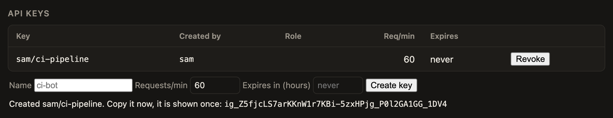

# Auth
{: .no_toc }

Auth is off on loopback. It is on everywhere else. Turn on what you need, in this order.

## 1. Local development

On a loopback address with no keys configured, no key is needed, and every caller is an admin. This is fine for your laptop.

## 2. Require a key

1. Set `api_key_env` to the name of an environment variable that holds the key.

```toml
listen = ":8081"
api_key_env = "IGNATIUS_API_KEY"
```

2. Export the key before you start the gateway.

```sh
export IGNATIUS_API_KEY=$(openssl rand -hex 32)
```

3. Send it as a Bearer token. A request with no credential gets a 403. A request with the wrong one gets a 401.


*Once a key is required, the status page is locked until you paste one.*


To rotate, put the new and old keys in the variable, separated by a comma. Remove the old one when every caller has moved.

If you listen on a non-loopback address with no key, the gateway refuses to start. Set `IGNATIUS_ALLOW_NO_AUTH=1` to override. Do that only behind another layer that handles auth.

## 3. Give each caller its own client

Each client has its own key, its own rate limit, and its own list of routes it may use.

1. Add a `[[clients]]` entry. The key comes from an environment variable.

```toml
[[clients]]
name = "support-bot"
key_env = "SUPPORT_BOT_KEY"
rate_limit_per_minute = 600
burst = 50
routes = ["triage", "fast"]
```

2. Hand the key to the caller.


*Admins see each client's requests, rate-limited count and spend. Keys never appear here.*


Past the rate limit, the gateway returns 429 `rate_limited` with a `Retry-After` header. A route outside the list returns 403 `route_not_allowed`. A restricted client sees the same error for a forbidden name and a name that doesn't exist, so it can't list your models.

The status page and `/v1/stats` need an admin. Add `admin = true` to a client that should see them. A non-admin key gets 403 `admin_required`.

Keys never show up in a response, a log or a stat. Recent requests record the client name only.

## 4. Sign people in with a password

Use this for people who shouldn't paste a key into the status page.

1. Make a bcrypt hash. The password is read from stdin, so it stays out of your shell history.

```sh
./ignatius hash-password
```

2. Add a user. A plaintext password in the config causes a startup error.

```toml
[[users]]
name = "sam"
password_hash = "$2a$12$..."
admin = true
```

3. Put the gateway behind TLS. If a proxy sits in front of it, set `[admin] trust_proxy = true`. Without that setting, every login throttles as one address, and the gateway warns you at startup.

The status page then shows a sign-in form. A login returns a short-lived session key. It lasts 8 hours by default. Sessions live in memory, so a restart signs everyone out.


*With users configured, the lock screen offers a username and password next to the key field.*


Wrong guesses are throttled before any password hashing happens. An unknown user and a wrong password give the same 401 `invalid_credentials`.

Groups, password reset, MFA and SSO are not part of this repo.

## 5. Let key holders mint keys

1. Turn it on, and set a state file. Keys have to survive a restart.

```toml
[admin]
self_service_keys = true
state_file = "/var/lib/ignatius/state.json"
```

2. Start with at least one configured key or user. That is the root of trust.


*Signed in, you see the API keys panel. Name a key, set a rate and an expiry, and create it.*



*The key is shown once. Only its hash is stored. This one came from a throwaway demo gateway.*


Anyone with a valid key can then mint more. Each key is stored only as a hash.

## 6. Edit profiles and routes at runtime

This is off by default. The config file is the source of truth.

1. Switch on the kinds you want.

```toml
[admin]
edit_profiles = true
edit_routes = true
state_file = "/var/lib/ignatius/state.json"   # optional
```

2. Sign in as an admin. Use the dropdowns and Edit buttons on the status page.


*Admins get the Edit buttons and the profile dropdowns.*


Without a `state_file`, edits are lost on restart. Models and clients can't be edited here because they hold URLs, keys and access rules.
