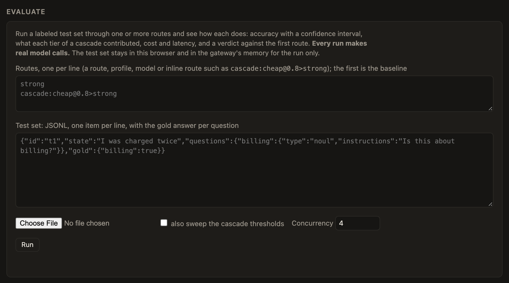

# Judging routes
{: .no_toc }

Is the cascade as good as the expensive model alone? And what does it save? `ignatius eval` runs a labeled test set through the routes you name and answers both.

1. Get a labeled test set. Two samples are in `examples/eval`: 57 hand-written support tickets, and 72 real GitHub pull requests.
2. Run it against two routes. Make the first route the baseline.

```sh
ignatius eval --config ignatius.toml --data test.jsonl --route strong --route 'cascade:cheap@0.8>strong' --sweep
```

3. Read the report. It gives accuracy with a confidence interval, what each tier contributed, cost, latency, how well confidence tracks correctness, and a plain verdict against the first route. `--sweep` also shows where a cascade's threshold should sit.

```
verdict: no detectable difference from strong (+0.0 points, 95% CI +0.0 to +0.0), at 35% of its cost
```

The same engine runs behind an admin API and the Evaluate panel on the status page. Turn it on with `[eval] enabled = true`. Every run makes real model calls.



*Paste the routes and a JSONL test set, or choose a file, then press Run.*


*The report: accuracy with a confidence interval, cost and latency per route, a miss list, a verdict against the baseline, and a threshold sweep. Demo data from two fake models, so the numbers mean nothing. The fake models answer at random, so don't read the verdict as a result.*


The test-set format and what is judged are in SPEC section 15.

## Rewriting the questions

`benchmarks/optimize` in the repo uses this same eval to try to improve the questions. It rewrites their instructions and option descriptions with GEPA, scores each candidate with `ignatius eval`, and recommends the new questions only if the accuracy gain on held-out items is detectable and the cost per item doesn't rise much. It is experimental, and it hasn't found a gain on the two sets we tried. Its README has the details.
