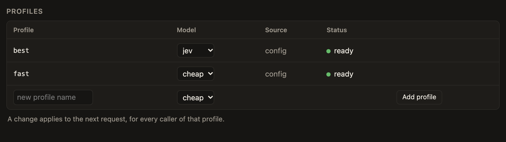
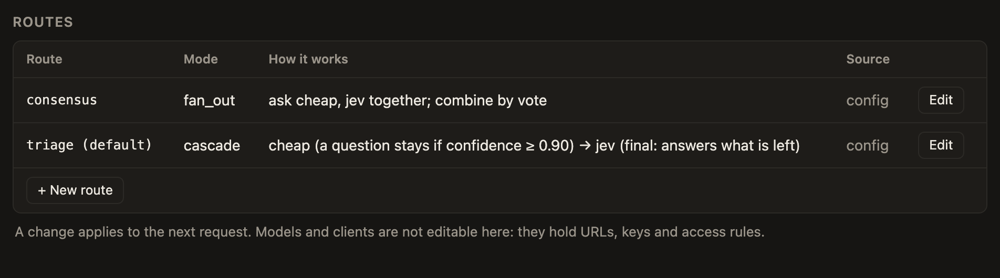
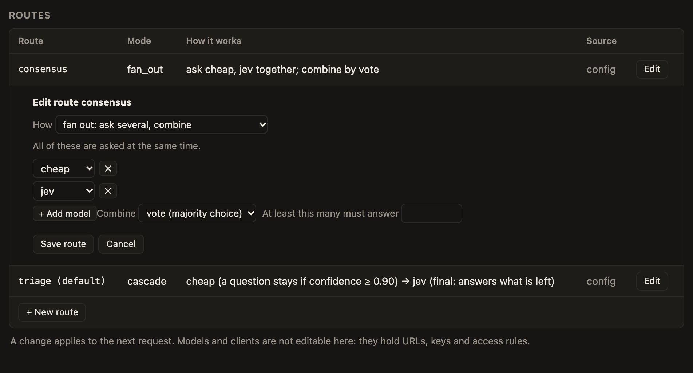
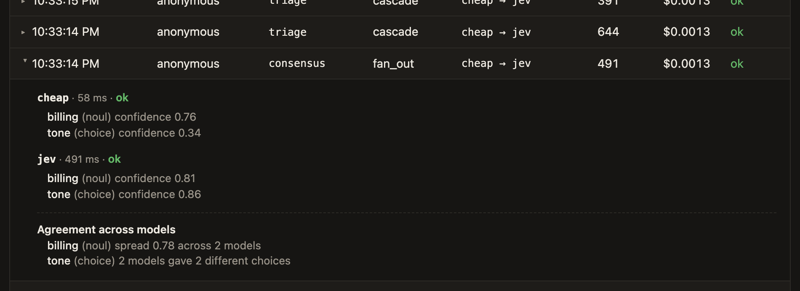

# Routes and cascades
{: .no_toc }

A route is a named plan: single, fan-out, or cascade.

## Pick a route

1. Name one in the `model` field of a request, like `"model": "triage"`.
2. Or use an alias, a profile, or an inline route written in the name, like `cascade:cheap@0.9>jev` or `fan-out:a,b|vote`.
3. If you send nothing, or `jev-latest`, you get `default_route`. If no default is set, the request fails.

A profile names an intent, like `fast` or `best`, so you can swap the model behind it in one line. Aliases name concrete models. Don't name an alias after a quality.

*Profiles name an intent. Each one points at a model, and you can retarget it from the dropdown when editing is on.*

*Every route, with a plain-language line on how it works.*

## Tune a cascade

1. Set a threshold on each tier. An answer at or above it stays. A lower one goes to the next tier.
2. Set the threshold per question type if you need to.
3. Set `confidence = "derived"` on every model, so the thresholds mean the same thing at every tier.
4. Calibrate on your own data before you trust the numbers.

*With `edit_routes` on, Edit opens the cascade editor: reorder tiers, set each tier's threshold, add a tier, and set a default threshold.*

*Check the result in the trace. Each question shows its confidence, the threshold it faced, and whether it settled or escalated. Demo data from two fake models, so the numbers mean nothing.*

If a tier fails, every question it was asked goes up a tier. If the last tier fails, those questions keep the best answer seen so far, or nothing at all. The failure shows up in `failures` and in the trace.

## Fan out

1. Set `mode = "fan_out"` and list the models.
2. Pick a reducer: `vote`, `mean`, or `most_confident`. Leave it unset and you get every answer back.
3. Set `min_success` to how many models must answer for the result to count.

*The fan-out editor lists the models, the reducer and the minimum number that must answer.*

*A fan-out trace shows every model's answer and how far they agreed. Demo data from two fake models, so the numbers mean nothing.*

## Keep it reliable and cheap

1. The circuit breaker opens when a model keeps failing, so a cascade skips it instead of waiting on timeouts.
2. The response cache is off by default. Turn it on to cache per question, with a TTL. Answers are held in memory.
3. Put prices in the model config and the status page shows spend. The saving estimate can come out negative if your cheap tier escalates too much.

*With prices set, the status page shows spend per model and an estimate of what the cascade saved. It can read negative, as it does here, when the cheap tier escalates too much. Demo data from two fake models, so the numbers mean nothing.*

